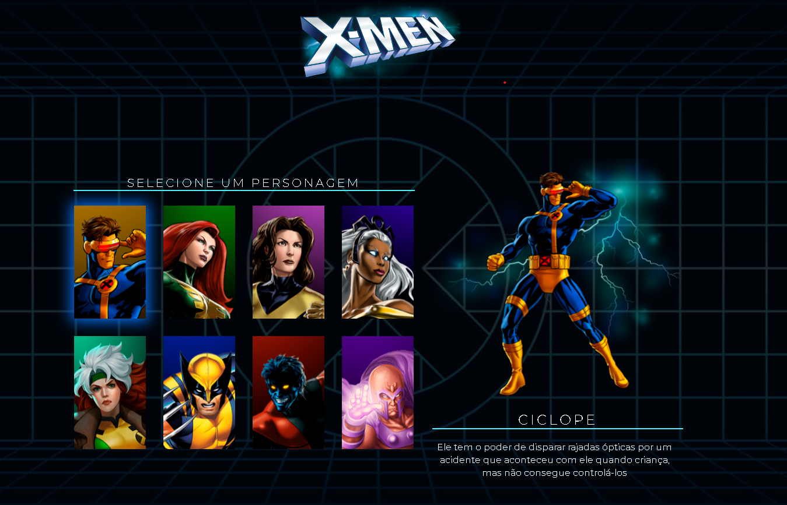

<h1 align="center">Seleção X-MEN</h1>

#### Este projeto é uma aplicação web simples que apresenta personagens do universo X-Men. Desenvolvido com HTML, CSS e JavaScript, permite aos usuários selecionar um personagem e visualizar suas informações detalhadas e imagem. O design é responsivo e a interatividade é implementada via manipulação do DOM.

## Tecnologias utilizadas 💻
- HTML
- CSS
- JavaScript